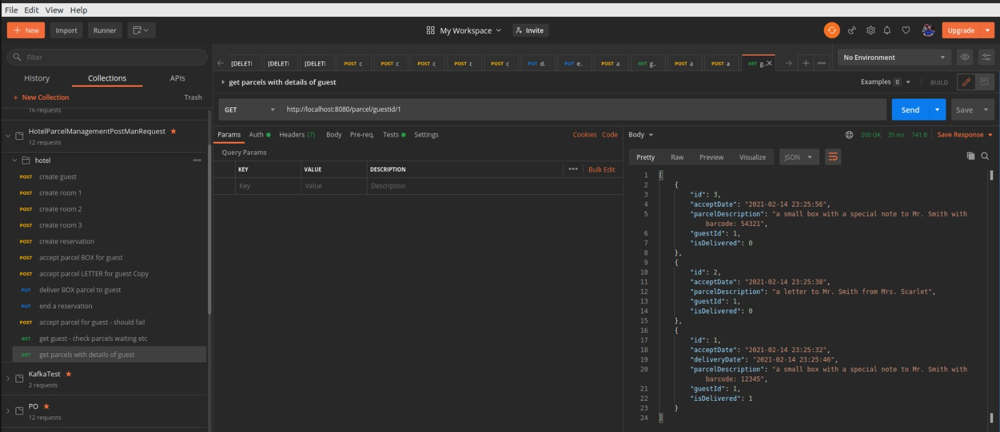
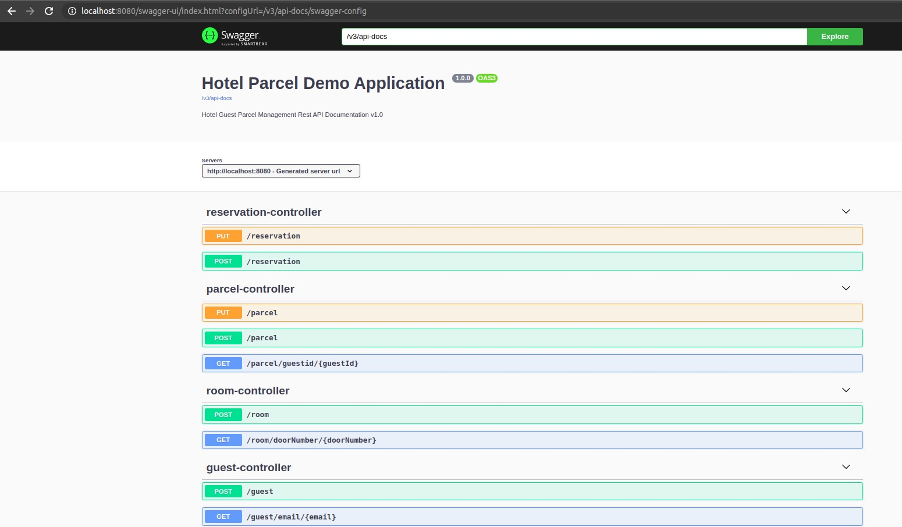
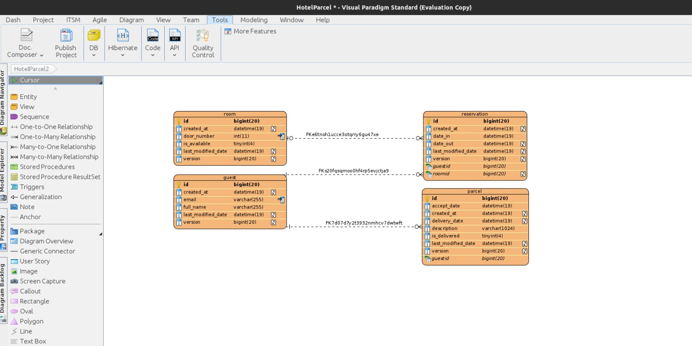

# DEMO APPLICATION FOR HRS ASSESSMENT

Problem Statement : Receptionists have to accomplish various tasks throughout the day when operating a hotel. One of those tasks is to accept parcels for guests.

* It happens, that receptionists accept parcels for guests, that was already checked out of the hotel.
* It happens from time to time, that guests forget to pick up their parcels before check-out and even forget it then.

## Requirements

1. The receptionist needs a tracking tool that knows to any given time which guests are checked into the hotel and have not checked out, to allow the receptionist to decide whether to accept the parcel or not.
2. The tracking tool should further allow the receptionist to check for parcels available for pick-up when the guest is checking out.

#How to compile & test & build & dockerize project
git clone https://github.com/sunels/hrsdemo.git
mvn clean package
java -jar /home/sunels/Downloads/hrsdemo/target/demov1-0.0.1-SNAPSHOT.jar

# How to Test with Postman

**Import** the file '_HotelParselManagement_Postman_Collection.json_' in **Postman** then
execute the request with the default order. Requests are ordered to see expected results.
 - `Create Guest`
 - `Create rooms`
 - `Create reservation`
 - `Accept parcel box for the guest`
 - `Accept parcel letter for the guest`
 - `Deliver parcel box to the guest`
 - `End the reservation for the guest`
 - `Try accept parcel for the guests after ending reservation, should fail !`
 - `Get guest profile with the list of delivered and waiting parcels and reservation id`
 - `List all parcel information for the given guestId`

# Swagger Endpoint
**http://localhost:8080/swagger-ui.html**

# Database Design Schema & Snapshot

# Work with mysql docker instance
docker run --name some-mysql -e MYSQL_ROOT_PASSWORD=root -p 3306:3306 -d mysql:latest

docker exec -it some-mysql mysql -uroot -p

create database test10;

use test10;

Keep it mind that application is configured in create-drop semantic in resources/application.yml

# UPLOAD DOCKER to DOCKER-HUB 
Create a docker registry in dockerhub exm: sunels/restfull-jpa-demo
In the terminal window

docker tag demov1:0.0.1-SNAPSHOT--240411_0920 sunels/restfull-jpa-demo:latest
docker push sunels/restfull-jpa-demo:latest

